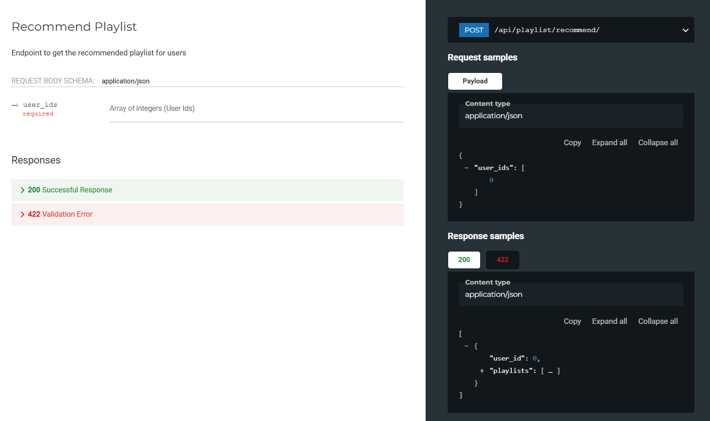

# Model Serving

## Serving from an API Endpoint

- We setup the API using [FastAPI](https://fastapi.tiangolo.com/). Reasons for choosing FastAPI for our Model Server
    - Ease to setup endpoints relatively fast for rapid prototyping and great developer experience
    - Our Model Server doesn’t just have Model Prediction task, it has I/O bound tasks (read/write to Redis). So, we choose FastAPI to leverage it’s native async capabilities
    - Bias and familiarity with using FastAPI
- The request body of our API endpoint is simply a list of `user_id` . Our output consists of map of `users_id`  mapped to the list of top-n recommended `playlist_id` for them.
    - Our API response output is strictly for testing and logging the predictions. We don’t serve the Predictions directly to the users from our Server!

## Identify Requirements

Our specific customer is Spotify. Based on our customer, we did a requirement analysis and identified:

- Have recommended playlists daily for daily users.
    - We can run the recommendation every day in scheduled batches rather than doing real-time inference
- Have the inference be done in an interval rather than real-time (based on existing features such as “Discover Weekly” and “Release Radar”)
- User should be able to get the recommended playlists with minimal latency
    - Note ⇒ Even though they should get the playlists with minimal latency, we don’t necessarily need to make the inference in real time.
- Have a method to get user feedback on the given recommendation

## Model Optimizations

- We tried to mimic the flow of how Spotify performs does personalized playlists recommendation.
- Our System comprises of 2 models, the User Pairing Model and the Playlist Ranking Model
- We actually have the User Pairing Model done in a “offline” environment and it isn’t done during the actual “online” inference. The Server simply fetches the data the output from User Pairing Model
    - The output from User Pairing is further processed during the “offline” environment; the User Pairing already maps the users to their neighbors’ playlist which is then used by the Model Server for inference
    - In a system like Spotify, this Pairing is stored and fetched through some sort of [vector database](https://lynkz.com.au/blog/2024-vector-databases) to represent the users’ preferences. For our demonstration, we are loading the user pairing directly to our server during startup and are using function to simulate the fetching of pairing from the database. We can find this done in`model_server/ml_models/model.py`

## System Optimization

- Docker Image
    - We focused on minimizing the docker image size and speeding up image build up time
        - To achieve this, we utilized [uv](https://docs.astral.sh/uv/) as the package manager to leverage its faster build installation time.
            - Implementing the uv package reduced our docker build for the Inference Server from around 300 seconds to 30 seconds in the KVM `m1.large` instance
        - We also utilized Multi-Stage Dockerfile to optimize Docker Images and mimic a Production Ready Docker Image Build. This can be seen the [Dockerfile](https://github.com/AguLeon/MLOps_G47_SpotifyBuddies/blob/main/model_server/Dockerfile).
            - We `bookworm-slim` as base image to optimize our Docker containers
        - For our first iteration, we tried utilizing Nvidia’s CUDA for our Inference Model. But, it caused more issues with minimal gain.
            - Issues:
                - Our image build time increased upward to 200s
                - Our image size was more than 6GB.
                - Minimal gain in performance:
                    - Our inference model has a embedding dimension of 128
                    - We are doing inference in batches of 1000 users
                    - Our use case doesn’t require real-time predictions (since our inference will be done in a schedule of once a day)
                - The performance benefit of using GPU did not justify the cost in size and complexity of the build
            - To optimize deployment
                - We switched to use `pytorch-cpu`  to run the model in the Inference server.
                - Although the model was originally trained on GPU, it is now served on CPU, which meets our latency and throughput requirements
            - Results:
                - Image Size went from 6 GB to around 2 GB
                - Build time decreased back to around 30 second
                - We didn’t need CUDA drivers or CPU support for production
            - Our `pyproject.toml` description for the model inference. [Link](https://github.com/AguLeon/MLOps_G47_SpotifyBuddies/blob/main/model_server/pyproject.toml)
    - PS: We are running Python 3.12 rather than Python 3.13 due to compatibility issues with libraries used by for machine learning libraries
        - Due to this, we couldn’t leverage disabling the GIL for non-blocking operations
- Making Inference Logic and IO logic non-blocking
    - Our Inference Server has 2 main jobs:
        - Prediction/Inference using the ML Model
        - I/O to the database (in our case; Redis)
    - Since ML Model is an expensive and blocking task, during high number of request calls to the inference, it would dominate the FastAPI event loop. So, we opted to run this in its own separate process with max worker of 1 to reduce IPC
    - Doing this, we effectively made the model prediction task into a non-blocking task. Through this, we can leverage the async nature of FastAPI.
        - The implementation can be seen in
            - def [intialize_model](https://github.com/AguLeon/MLOps_G47_SpotifyBuddies/blob/main/model_server/ml_model/model.py)
            - def [recommend_playlist](https://github.com/AguLeon/MLOps_G47_SpotifyBuddies/blob/main/model_server/ml_model/recommender.py)
            - [API endpoint in action](https://github.com/AguLeon/MLOps_G47_SpotifyBuddies/blob/main/model_server/routers/playlist.py)
        - NOTE ⇒ We also have a implementation that uses RabbitMQ as message broker to send the prediction jobs to workers, all of whom then send the prediction directly to Redis. But, due to time constraint, this hasn’t been tested thoroughly.
            - The implementation can be seen in
                - `./model_server/services/rabbitmq.py`
                - `./model_server/services/rabbitmq_worker.py`
                - `./model_server/routes/playlist.py`  in the `beta_recommend` route
- Batch Input
    - For recommendation systems that are run in a schedule, the inference is done in batches of input. So, we opted to use that
        - Through our offline experiments, we found out that our model could run batches of 1000 ([experiment link](https://github.com/AguLeon/MLOps_G47_SpotifyBuddies/blob/main/training/sb_inference_model_v2.py)) inputs with significant improvement when compared to sequential predictions.
        - So, to enable that, we modified the prediction function to accommodate batch inference based on the above experiment
            - Implementation [Recommender().predict()](https://github.com/AguLeon/MLOps_G47_SpotifyBuddies/blob/main/model_server/ml_model/model.py)
